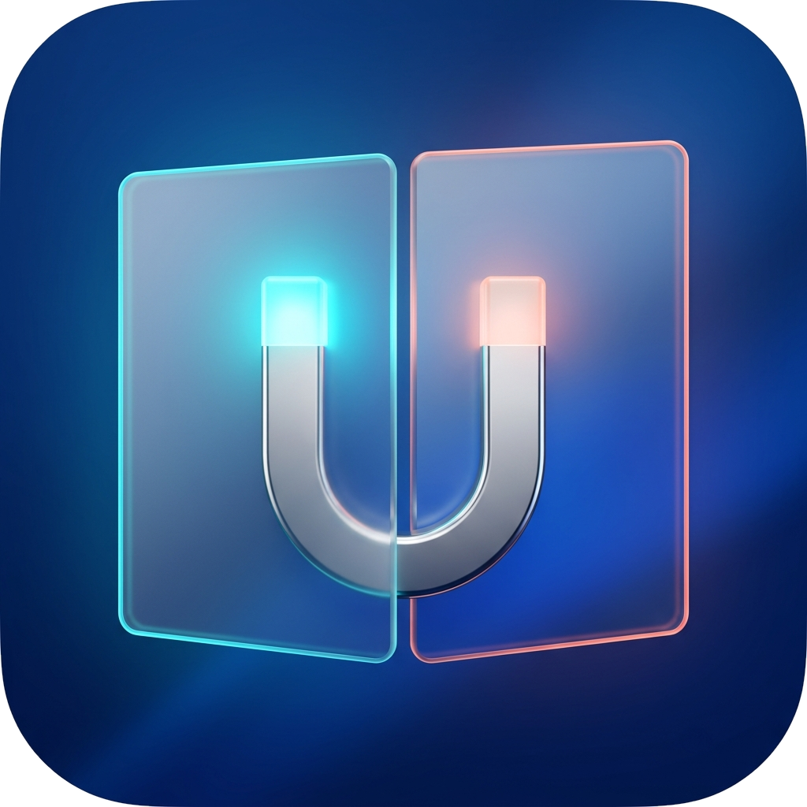
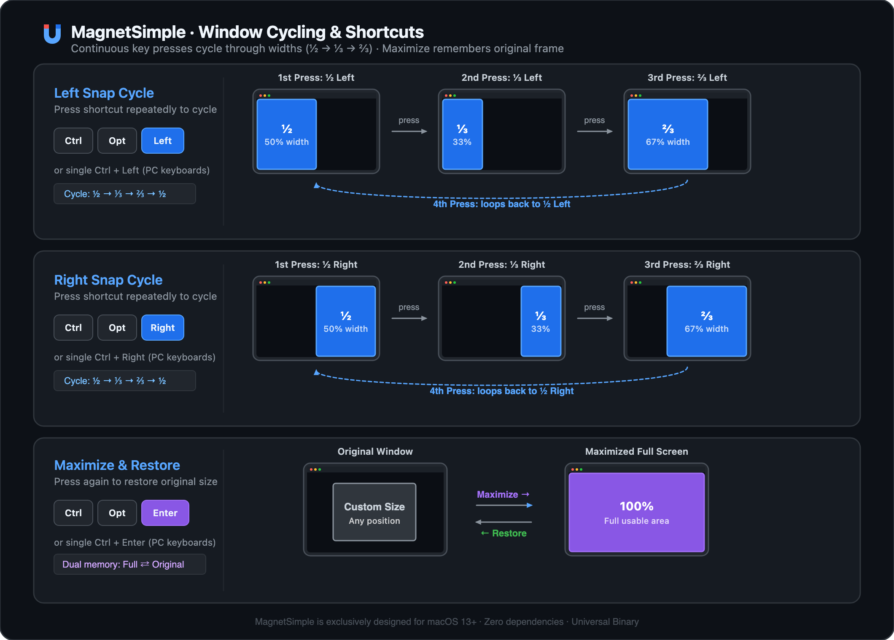

# MagnetSimple

<p align="center">
  
</p>

<p align="center">
  <strong>A minimal, native macOS window manager.</strong><br>
  3 hotkeys. ~600 lines of Swift. Zero dependencies.<br>
  <sub>极简原生 macOS 窗口管理工具 · 3 个快捷键 · ~600 行 Swift · 零外部依赖</sub>
</p>

<p align="center">
  
  
  
  
</p>

---

Most window managers do way more than you need. MagnetSimple does exactly three things: snap left, snap right, and maximize — then gets out of your way.

Built natively for macOS with pure Swift and system APIs (AppKit, Carbon, Accessibility). It lives quietly in your menu bar, takes ~600 lines of code, consumes ~5 MB of RAM, and requires zero external dependencies.

*(Note: Designed exclusively for macOS 13+. Windows and Linux are not supported.)*

---

大多数窗口管理工具的功能都远超日常所需。MagnetSimple 只专注做好三件事：左半屏、右半屏、以及全屏与还原 —— 随后彻底淡出视野，不打扰你的工作流。

基于纯 Swift 与系统底层 API（AppKit、Carbon、Accessibility）打造。常驻菜单栏不占 Dock 栏，源码仅约 600 行，运行内存仅约 5 MB，完全零外部依赖且开源免费。

*（注：本工具为 macOS 13+ 原生专属，不支持 Windows 或 Linux 操作系统。）*

## How it compares

| | MagnetSimple | Magnet | Rectangle | Moom |
|:---|:---:|:---:|:---:|:---:|
| Left/right snap with ½ ⅓ ⅔ cycle | Yes | Yes | Yes | No (grid-based) |
| Price | Free | $4.99 | Free | $15 |
| External dependencies | None | — | ShortcutRecorder, etc. | — |
| Source lines | ~600 | Closed source | ~15,000 | Closed source |
| Memory footprint | ~5 MB | ~20 MB | ~25 MB | ~30 MB |
| Dock icon | Hidden | Hidden | Optional | Hidden |

## Shortcuts

<p align="center">
  
</p>

| Keys | Alternative | Action |
|:---|:---|:---|
| `⌃⌥←` | `⌃←` | Snap left — cycles through ½ → ⅓ → ⅔ |
| `⌃⌥→` | `⌃→` | Snap right — cycles through ½ → ⅓ → ⅔ |
| `⌃⌥↩` | `⌃↩` | Toggle maximize / restore |

The `Control`-only alternatives exist for external keyboards (such as PC/Windows layout keyboards connected to a Mac) that lack an Option key.

## What it does

- Lives in the menu bar. No Dock icon, no clutter in `⌘Tab`.
- Keeps pressing the same shortcut to cycle through ½, ⅓, and ⅔ widths.
- Remembers each window's original position before maximizing — press again to restore.
- Each window tracks its own snap state independently.
- Works across multiple displays, accounting for the menu bar and Dock.
- Launch at login via the menu bar toggle (uses `SMAppService`).
- Grants accessibility permission at runtime — no restart needed after authorization.

## Requirements

- **macOS only** — macOS 13.0 (Ventura) or later. **Windows and Linux are not supported.**
- Universal Binary — runs natively on both Apple Silicon (M-series) and Intel Macs.

## Install

### From Releases

1. Download `MagnetSimple.zip` from [Releases](../../releases)
2. Unzip and move `MagnetSimple.app` to `/Applications`
3. Double-click to launch

> **First launch note:** Since MagnetSimple is not notarized with an Apple Developer certificate, macOS Gatekeeper will block the first launch. Click **Done** to dismiss, then go to **System Settings → Privacy & Security**, scroll down, and click **Open Anyway**. This only needs to be done once.
>
> Alternatively, clear the quarantine flag from Terminal:
> ```bash
> xattr -cr /Applications/MagnetSimple.app
> ```

### From source

```bash
git clone https://github.com/xemee82/magnet-simple.git
cd magnet-simple
./build.sh
open build/MagnetSimple.app
```

The build script compiles arm64 and x86_64 separately, merges them with `lipo`, signs with an ad-hoc signature, and produces both `MagnetSimple.app` and `MagnetSimple.zip` under `build/`.

## First run

1. A horseshoe magnet icon appears in the menu bar
2. macOS prompts for Accessibility permission — grant it in **System Settings → Privacy & Security → Accessibility**
3. Hotkeys activate within 2 seconds, no restart needed

## Project layout

```
Sources/MagnetSimple/
  main.swift              Entry point
  AppDelegate.swift       Menu bar UI, permission polling, launch-at-login
  HotKeyManager.swift     Carbon global hotkey registration
  WindowManager.swift     AX API window positioning and snap-cycle state machine

Resources/
  Info.plist              App bundle configuration
  AppIcon.icns            Application icon
  MenuBarIcon.png         Menu bar icon (1x)
  MenuBarIcon@2x.png      Menu bar icon (2x Retina)

build.sh                  One-command build & package script
```

## Under the hood

Built entirely on macOS system frameworks — AppKit, Carbon, ApplicationServices, and ServiceManagement. No SwiftUI, no third-party packages, no Xcode project file.

Key implementation details:

- **Carbon hotkeys** via `RegisterEventHotKey` for true system-wide shortcuts that work regardless of which app is focused.
- **AXUIElement API** for reading and writing window frames. Coordinates are translated between the Accessibility coordinate system (origin top-left) and Cocoa (origin bottom-left).
- **Three-pass resize** — set size, then position, then size again — to work around system clamping that can cause partial resizes on windows near screen edges.
- **Tolerance-based cycle detection** using `isApproximatelyEqual` with a 10px threshold, so the ½ → ⅓ → ⅔ cycle keeps working even when apps enforce a minimum window width (e.g., Outlook's calendar view can't shrink to exactly ⅓).
- **Per-window state tracking** via `CFHash` so each window independently remembers its snap position and cycle state.

## FAQ

<details>
<summary>Hotkeys don't work</summary>

Check the menu bar icon — if it shows a warning, Accessibility permission hasn't been granted. Go to **System Settings → Privacy & Security → Accessibility** and make sure MagnetSimple is checked. If it was previously checked for an older build, remove it with the `-` button and re-add.
</details>

<details>
<summary>Some windows won't snap to ⅓ width</summary>

Some apps set a minimum window width that's wider than ⅓ of the screen (Outlook's calendar view is a common example). This is an app-level constraint, not a bug. The cycle logic has built-in tolerance to handle this gracefully — it'll still advance to the next state even if the window couldn't reach the exact target size.
</details>

<details>
<summary>Launch at login doesn't persist after reboot</summary>

Make sure `MagnetSimple.app` is in `/Applications`. The `SMAppService` API requires a stable path.
</details>

<details>
<summary>How does this compare to macOS 15 Sequoia's built-in window tiling?</summary>

macOS 15 introduced basic window tiling, but it only splits into fixed halves and quarters. It does not support cycling through ½ → ⅓ → ⅔ widths, does not restore window sizes when toggling maximize, and is only available on macOS 15+. MagnetSimple supports macOS 13+ and provides fluent multi-width cycle snapping with per-window memory.
</details>

<details>
<summary>Does MagnetSimple support Windows or Linux?</summary>

No. MagnetSimple is built exclusively on macOS system APIs (AppKit, Carbon event hotkeys, and macOS Accessibility). It does not work on Windows or Linux, and there are no plans for cross-platform support.
</details>

## Contributing

Issues and pull requests welcome. See [CONTRIBUTING.md](CONTRIBUTING.md) for details.

MagnetSimple is intentionally minimal. Feature requests that align with the "do three things well" philosophy are most likely to be accepted.

## License

[MIT](LICENSE)

## Acknowledgments

Inspired by [Magnet](https://magnet.crowdcafe.com/), [Rectangle](https://rectangleapp.com/), [Moom](https://manytricks.com/moom/), and [Spectacle](https://www.spectacleapp.com/).
